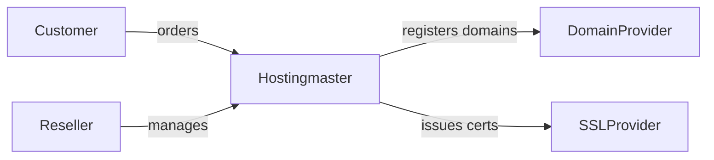
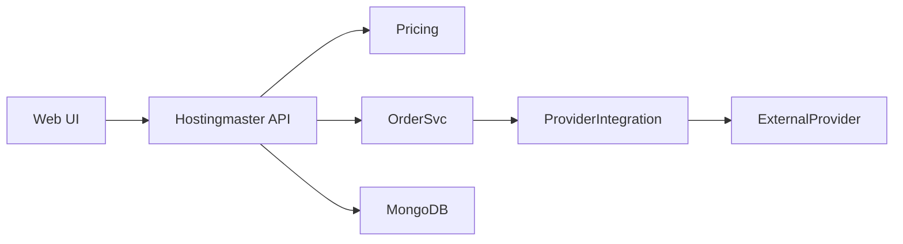
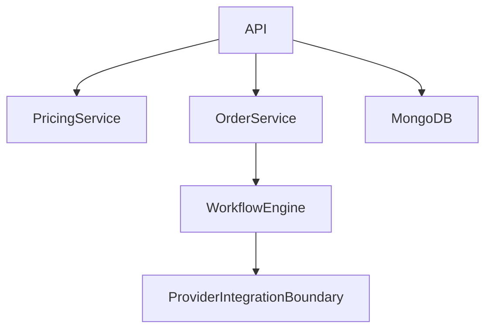
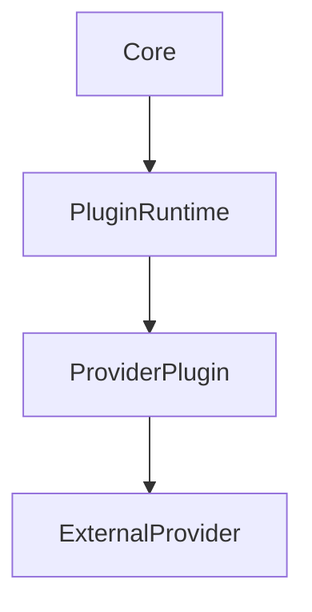
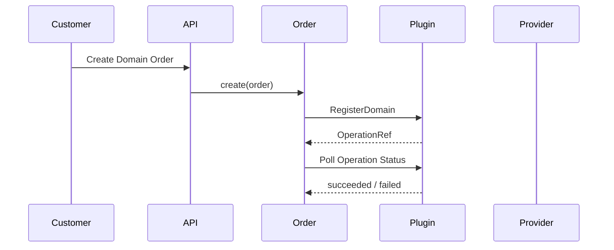
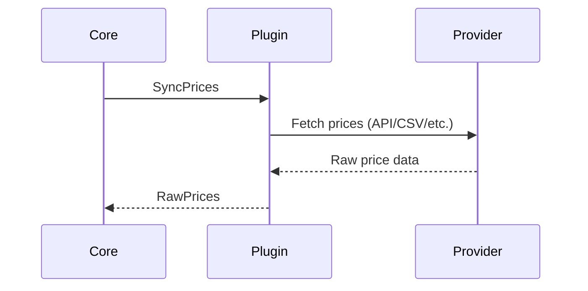
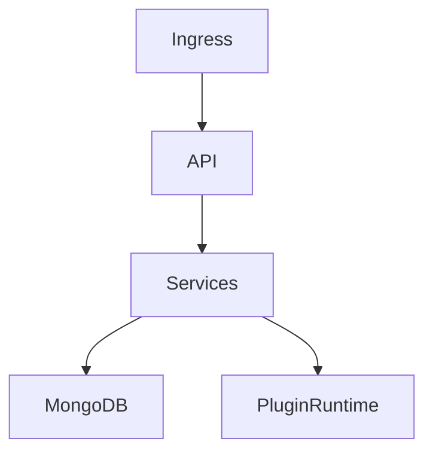

# Hostingmaster – arc42 Architecture Documentation

# 1. Introduction and Goals

## 1.1 Requirements Overview

Hostingmaster is a **white-label, multi-tenant hosting management platform**.

MVP scope:

* Hierarchical reseller model (reseller → sub-reseller → customer)
* Domain management via external providers
* SSL certificate management via external providers
* Asynchronous provisioning workflows
* Kubernetes-based runtime
* MongoDB-based persistence

Out of scope for MVP:

* Domain transfers
* Customer-owned provider accounts
* Advanced promotions/coupons

---

## 1.2 Quality Goals

| Priority | Quality Goal           | Description                                                         |
| -------- | ---------------------- | ------------------------------------------------------------------- |
| 1        | Tenant Isolation       | Strong logical separation of resellers, sub-resellers and customers |
| 2        | Extensibility          | New providers and products can be added without core refactoring    |
| 3        | Auditability           | Pricing, orders and provisioning decisions are traceable            |
| 4        | Scalability            | Horizontal scaling via Kubernetes                                   |
| 5        | White-label Capability | Branding and pricing fully controlled by resellers                  |

---

## 1.3 Stakeholders

| Role           | Expectations                                         |
| -------------- | ---------------------------------------------------- |
| Platform Owner | Stable, extensible hosting platform                  |
| Platform Admin | Operability, provider integration, lifecycle control |
| Reseller       | Full pricing control, sub-reseller support           |
| Customer       | Simple domain & SSL management                       |
| Provider       | Correct API usage, rate limits respected             |

---

# 2. Architecture Constraints

* Kubernetes is the mandatory runtime environment
* MongoDB is used for persistence
* External providers are integrated asynchronously
* Multi-tenancy is enforced at application level
* No shared credentials across reseller boundaries
* Provider integration must be protocol-agnostic (REST, SOAP, CSV, SDK, etc.)

---

# 3. Context and Scope

## 3.1 Business Context

Hostingmaster acts as an intermediary between customers/resellers and external domain/SSL providers.

---

## 3.2 Technical Context

**ProviderIntegration** represents the bounded integration layer responsible for all external provider communication.

---

# 4. Solution Strategy

* Modular services with clear responsibilities
* **Capability-based provider plugin architecture**
* Strict separation of provisioning and pricing
* Deterministic pricing engine
* Asynchronous order processing
* Explicit lifecycle state machines
* Provider instability must not impact core stability

---

# 5. Building Block View

## 5.1 Whitebox Overall System

### Contained Building Blocks

* API Gateway
* Pricing Service
* Order Service
* Workflow Engine
* **Provider Integration Boundary**
* MongoDB

---

### Provider Integration Boundary

Responsibility:

* Acts as the **sole integration boundary** to all external providers
* Encapsulates provider-specific protocols, APIs, formats and quirks
* Exposes a **uniform, versioned runtime contract** to the core

Contained logical components:

* Plugin Registry (installed provider plugins and metadata)
* Plugin Runtime (isolatable execution boundary)
* Provider Plugins (capability adapters)

The core system is **fully protocol-agnostic**.

---

### Pricing Service

Responsibility:

* Deterministic price resolution
* Explicit price overrides
* Derived pricing rules (markup / markdown)
* Inheritance across reseller hierarchy
* Handling of included-domain benefits

---

### Order Service

Responsibility:

* Order creation and persistence
* Lifecycle state management
* Tracking of provisioning operations
* Audit-ready storage of price breakdowns

---

## 5.2 Level 2 – Provider Integration Boundary

**Key rule:** The core never communicates directly with external providers.

---

# 6. Runtime View

## 6.1 Domain Order (Asynchronous)

**Architectural rule:** All provisioning operations are asynchronous and tracked via explicit operation references.

---

## 6.2 Pricing Import

Raw provider prices are **never exposed directly to customers**.

---

# 7. Deployment View

## 7.1 Infrastructure Level 1

The Plugin Runtime is logically separable and may be isolated for fault containment.

---

# 8. Cross-cutting Concepts

## 8.1 Multi-Tenancy

* Hierarchical reseller tree
* Explicit resellerId on all business entities
* Tenant filtering enforced server-side

---

## 8.2 Provider Plugins & Capabilities

* Plugins declare explicit capabilities (Domains, SSL, Pricing)
* Missing capabilities are **valid and expected**
* UI and workflows are gated based on declared capabilities

---

## 8.3 Pricing

* Deterministic evaluation order
* No provider pricing logic in core
* Full audit trail for every price decision

---

## 8.4 Security

* Provider credentials are referenced, never embedded
* Plugins must not persist secrets
* Provider access is limited to reseller scope

---

# 9. Architecture Decisions

Architectural decisions are documented separately as ADRs.

---

# 10. Quality Requirements

## Quality Scenarios

* A reseller overrides prices without affecting parent or sibling resellers
* A provider outage does not block API availability
* A provider without pricing API can still be onboarded

---

# 11. Risks and Technical Debt

* Provider API inconsistency and instability
* Growing complexity of pricing rules
* Operational overhead of plugin isolation

---

# 12. Glossary

| Term                          | Definition                                           |
| ----------------------------- | ---------------------------------------------------- |
| Reseller                      | Tenant that sells services                           |
| Provider                      | External domain/SSL supplier                         |
| Provider Plugin               | Capability-based adapter to an external provider     |
| Provider Integration Boundary | Architectural boundary isolating provider complexity |
| OperationRef                  | Reference to an asynchronous provisioning operation  |
