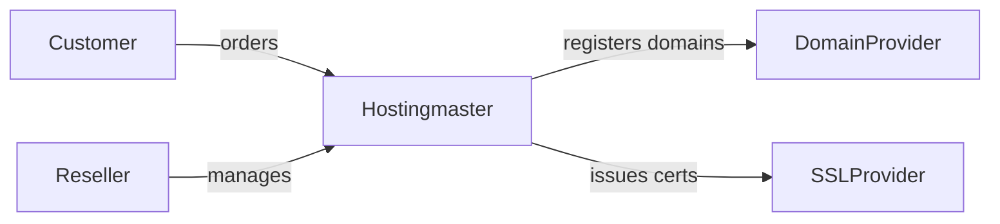
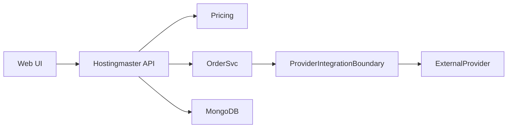
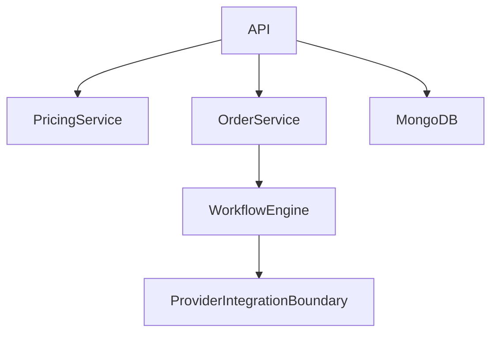
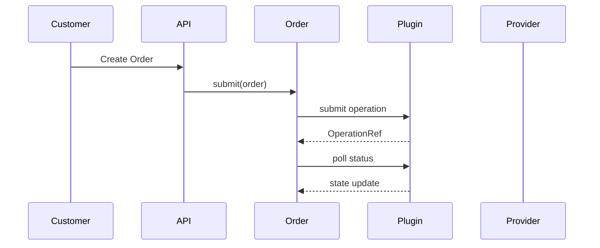
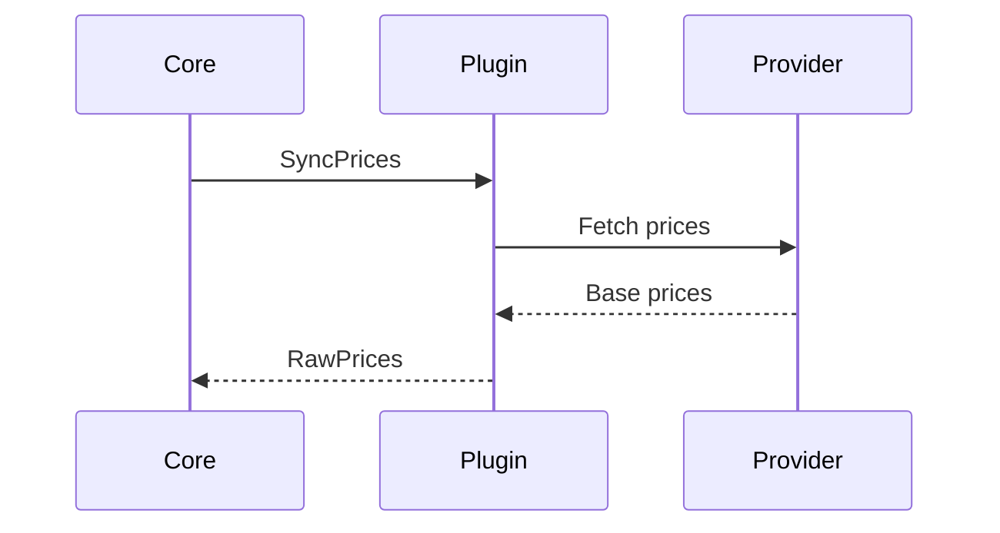
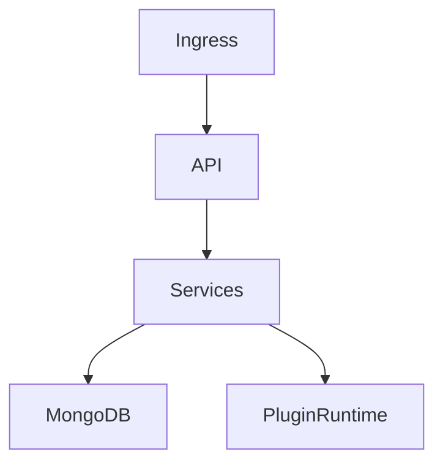

# Hostingmaster – arc42 Architecture Documentation

> **Status:** Binding architecture baseline for Hostingmaster MVP
> **ADR coverage:** ADR-0001 … ADR-0013 (fully integrated)

---

# 1. Introduction and Goals

## 1.1 Requirements Overview

Hostingmaster is a **white-label, multi-tenant hosting management platform**.

MVP scope:

* Hierarchical reseller model (reseller → sub-reseller → customer)
* Domain management via external providers
* SSL certificate management via external providers
* Asynchronous provisioning workflows
* Kubernetes-based runtime
* MongoDB-based persistence

Out of scope for MVP:

* Domain transfers
* Customer-owned provider accounts
* Advanced promotions/coupons

---

## 1.2 Quality Goals

| Priority | Quality Goal           | Description                                                         |
| -------- | ---------------------- | ------------------------------------------------------------------- |
| 1        | Tenant Isolation       | Strong logical separation of resellers, sub-resellers and customers |
| 2        | Extensibility          | New providers and products can be added without core refactoring    |
| 3        | Auditability           | Pricing, orders and provisioning decisions are traceable            |
| 4        | Scalability            | Horizontal scaling via Kubernetes                                   |
| 5        | White-label Capability | Branding and pricing fully controlled by resellers                  |

---

## 1.3 Stakeholders

| Role           | Expectations                                         |
| -------------- | ---------------------------------------------------- |
| Platform Owner | Stable, extensible hosting platform                  |
| Platform Admin | Operability, provider integration, lifecycle control |
| Reseller       | Full pricing control, sub-reseller support           |
| Customer       | Simple domain & SSL management                       |
| Provider       | Correct API usage, rate limits respected             |

---

# 2. Architecture Constraints

* Kubernetes is the mandatory runtime environment
* MongoDB is used for persistence
* External providers are integrated asynchronously (**ADR-0003, ADR-0007**)
* Multi-tenancy is enforced technically, not by convention (**ADR-0012**)
* No shared credentials across reseller boundaries
* Provider integration must be protocol-agnostic (REST, SOAP, CSV, SDK, etc.) (**ADR-0001**)

---

# 3. Context and Scope

## 3.1 Business Context

Hostingmaster acts as an intermediary between customers/resellers and external domain/SSL providers.

---

## 3.2 Technical Context

The **Provider Integration Boundary** is the only architectural point allowed to communicate with external providers (**ADR-0001, ADR-0006**).

---

# 4. Solution Strategy

* Modular services with clear responsibilities
* **Capability-based provider plugin architecture** (**ADR-0001, ADR-0005**)
* Process-isolated plugin runtime with gRPC contract (**ADR-0002, ADR-0006**)
* Strict separation of provisioning and pricing (**ADR-0004**)
* Deterministic pricing with snapshots (**ADR-0009**)
* Asynchronous order processing with explicit state machines (**ADR-0003, ADR-0007**)
* Provider instability must not impact core stability

---

# 5. Building Block View

## 5.1 Whitebox Overall System

Contained building blocks:

* API Gateway
* Pricing Service
* Order Service
* Workflow Engine
* **Provider Integration Boundary**
* MongoDB

---

## 5.2 Provider Integration Boundary

Responsibility:

* Sole integration boundary to all external providers (**ADR-0001**)
* Encapsulation of provider-specific protocols and quirks
* Exposure of a **versioned runtime contract** to the core (**ADR-0002**)

Logical components:

* Plugin Registry (installed plugins + versions)
* Plugin Runtime (process-isolated) (**ADR-0006, ADR-0011**)
* Provider Plugins (capability adapters)

The core system is **fully protocol-agnostic**.

---

# 6. Runtime View

> **Binding ADRs:** ADR-0007, ADR-0008, ADR-0013

## 6.1 Domain & SSL Provisioning (Asynchronous)

All provisioning actions:

* return an **OperationRef** (**ADR-0003**)
* follow the explicit operation state machine (**ADR-0007**)
* are polled via scheduler with backoff and rate limits (**ADR-0008**)
* may enter `needs_reconciliation` on inconsistencies (**ADR-0013**)

---

## 6.2 Pricing Import & Resolution

> **Binding ADRs:** ADR-0004, ADR-0009

* Plugins import **raw provider prices only**
* Final prices are resolved in core
* A **PriceSnapshot** is locked at order submission time

---

# 7. Deployment View

> **Binding ADRs:** ADR-0006, ADR-0011

* Plugin Runtime runs **process-isolated**
* Plugin versions may be **active** or **draining**
* Operations are pinned to plugin versions

---

# 8. Cross-cutting Concepts

## 8.1 Multi-Tenancy

> **Binding ADR:** ADR-0012

* Hierarchical reseller tree
* Explicit TenantContext on every request
* Tenant filtering enforced at persistence layer

---

## 8.2 Provider Plugins & Capabilities

> **Binding ADRs:** ADR-0001, ADR-0005

* Capabilities are explicit and structured
* Missing capabilities are valid
* UI and workflows are gated by capabilities

---

## 8.3 Pricing

> **Binding ADRs:** ADR-0004, ADR-0009

* Deterministic resolution order
* Snapshot-based consistency
* Full audit trail

---

## 8.4 Security & Credentials

> **Binding ADR:** ADR-0010

* Provider credentials are referenced, never embedded
* Credentials are versioned
* Rotation does not break in-flight operations

---

# 9. Architecture Decisions

The following ADRs are **binding**:

* ADR-0001 Provider Plugin Architecture
* ADR-0002 Plugin Runtime Contract (gRPC)
* ADR-0003 Asynchronous Provisioning Model
* ADR-0004 Pricing Import & Resolution
* ADR-0005 Capability Discovery & Gating
* ADR-0006 Plugin Isolation & Runtime Topology
* ADR-0007 Operation Model & State Machine
* ADR-0008 Polling, Rate Limiting & Retry Semantics
* ADR-0009 Pricing Snapshot & Versioning
* ADR-0010 Credential Versioning & Rotation
* ADR-0011 Plugin Versioning & Rollout
* ADR-0012 Multi-Tenancy Enforcement
* ADR-0013 Reconciliation & Compensating Transactions

---

# 10. Quality Requirements

* Provider outages do not block API availability
* Pricing is deterministic and reproducible
* Tenant isolation is technically enforced

---

# 11. Risks and Technical Debt

* Provider API inconsistency
* Operational overhead of plugin isolation
* Complexity of reconciliation logic

---

# 12. Glossary

| Term                          | Definition                                           |
| ----------------------------- | ---------------------------------------------------- |
| Provider Plugin               | Capability-based adapter to an external provider     |
| Provider Integration Boundary | Architectural boundary isolating provider complexity |
| OperationRef                  | Reference to an asynchronous provisioning operation  |
