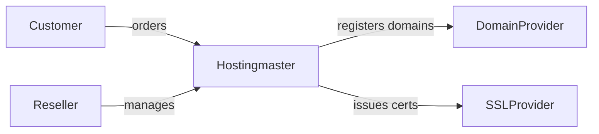
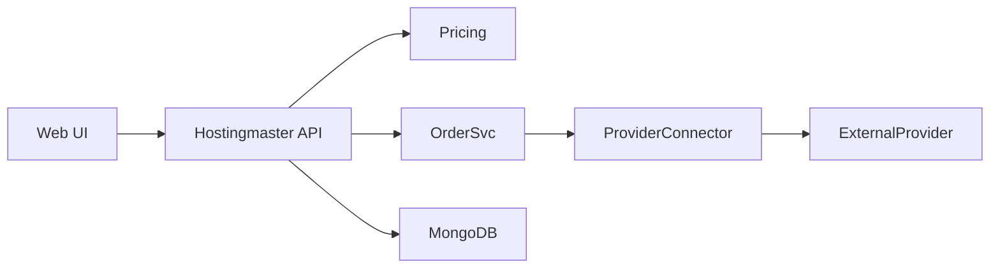
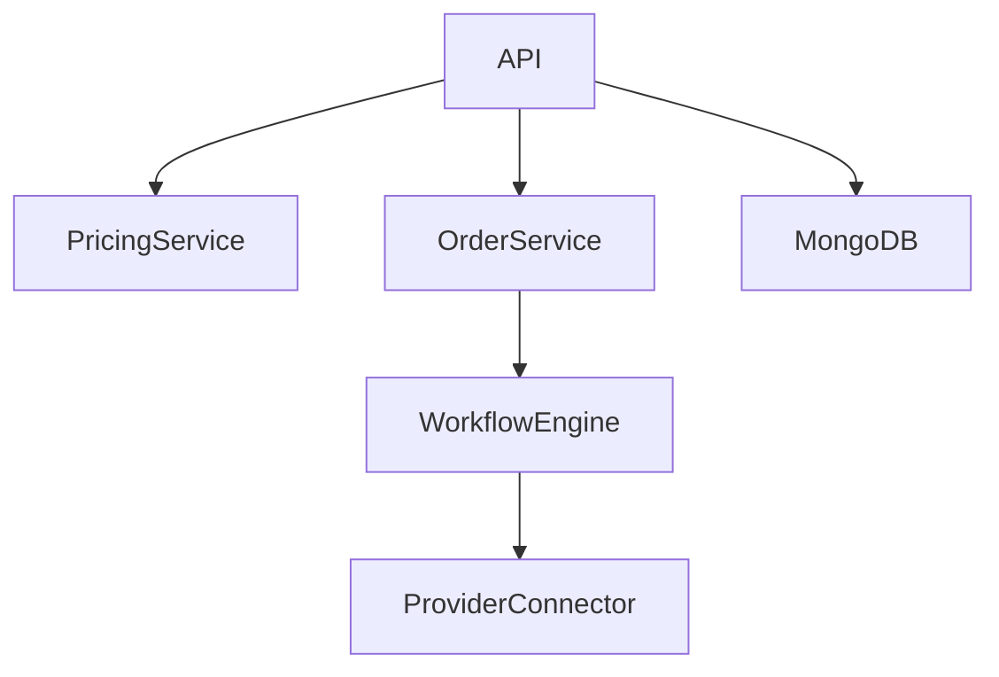
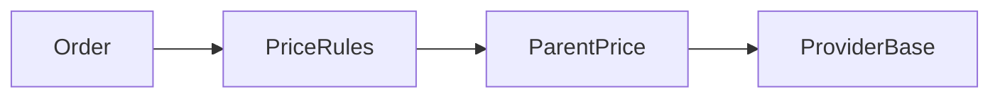
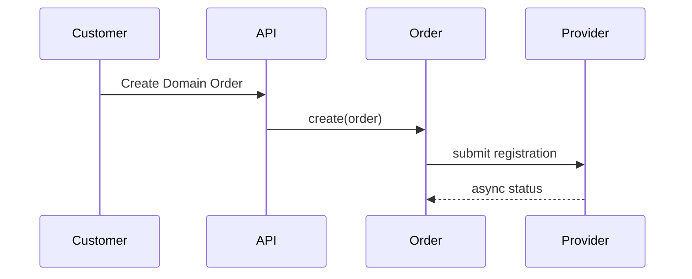
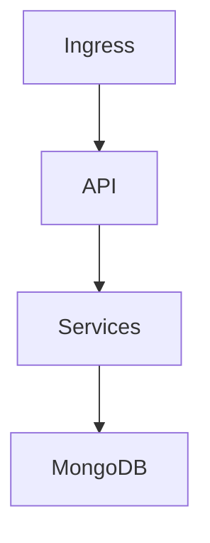

# Hostingmaster – arc42 Architecture Documentation

# 1. Introduction and Goals

## 1.1 Requirements Overview

Hostingmaster is a **white-label, multi-tenant hosting management platform**.

MVP scope:

* Hierarchical reseller model (reseller → sub-reseller → customer)
* Domain management via external providers
* SSL certificate management via external providers
* Asynchronous provisioning workflows
* Kubernetes-based runtime
* MongoDB-based persistence

Out of scope for MVP:

* Domain transfers
* Customer-owned provider accounts
* Advanced promotions/coupons

---

## 1.2 Quality Goals

| Priority | Quality Goal           | Description                                                         |
| -------- | ---------------------- | ------------------------------------------------------------------- |
| 1        | Tenant Isolation       | Strong logical separation of resellers, sub-resellers and customers |
| 2        | Extensibility          | New providers and products can be added without core refactoring    |
| 3        | Auditability           | Pricing, orders and provisioning decisions are traceable            |
| 4        | Scalability            | Horizontal scaling via Kubernetes                                   |
| 5        | White-label Capability | Branding and pricing fully controlled by resellers                  |

---

## 1.3 Stakeholders

| Role           | Expectations                                         |
| -------------- | ---------------------------------------------------- |
| Platform Owner | Stable, extensible hosting platform                  |
| Platform Admin | Operability, provider integration, lifecycle control |
| Reseller       | Full pricing control, sub-reseller support           |
| Customer       | Simple domain & SSL management                       |
| Provider       | Correct API usage, rate limits respected             |

---

# 2. Architecture Constraints

* Kubernetes is the mandatory runtime environment
* MongoDB is used for persistence
* External providers are integrated asynchronously
* Multi-tenancy is enforced at application level
* No shared credentials across reseller boundaries

---

# 3. Context and Scope

## 3.1 Business Context

Hostingmaster acts as an intermediary between customers/resellers and external domain/SSL providers.

---

## 3.2 Technical Context

---

# 4. Solution Strategy

* Modular services with clear responsibilities
* Provider abstraction via connector pattern
* Deterministic pricing engine
* Asynchronous order processing
* Explicit lifecycle state machines

---

# 5. Building Block View

## 5.1 Whitebox Overall System

### Contained Building Blocks

* API Gateway
* Pricing Service
* Order Service
* Workflow Engine
* Provider Connectors
* MongoDB

---

### Pricing Service

Responsibility:

* Price resolution (override, markup, inheritance)
* Bundle and included-domain handling

---

### Order Service

Responsibility:

* Order creation
* Lifecycle state management
* Persistence of price breakdowns

---

### Provider Connector

Responsibility:

* Encapsulation of provider-specific APIs
* Async communication and retries

---

## 5.2 Level 2 – Pricing

---

# 6. Runtime View

## 6.1 Domain Order

---

# 7. Deployment View

## 7.1 Infrastructure Level 1

Hostingmaster runs fully inside a Kubernetes cluster.

---

# 8. Cross-cutting Concepts

## 8.1 Multi-Tenancy

* Hierarchical reseller tree
* Tenant filtering on every query

## 8.2 Pricing

* Deterministic rule evaluation
* Audit-ready price breakdowns

## 8.3 Security

* Secrets stored in Kubernetes Secrets (Vault later)
* No cross-tenant access

---

# 9. Architecture Decisions

Architectural decisions are documented separately as ADRs.

---

# 10. Quality Requirements

## Quality Scenarios

* A reseller defines custom prices without affecting parent resellers
* A provider outage does not block the API

---

# 11. Risks and Technical Debt

* Provider API inconsistencies
* Complex pricing rules over time

---

# 12. Glossary

| Term      | Definition                   |
| --------- | ---------------------------- |
| Reseller  | Tenant that sells services   |
| Provider  | External domain/SSL supplier |
| Connector | Adapter to provider API      |
